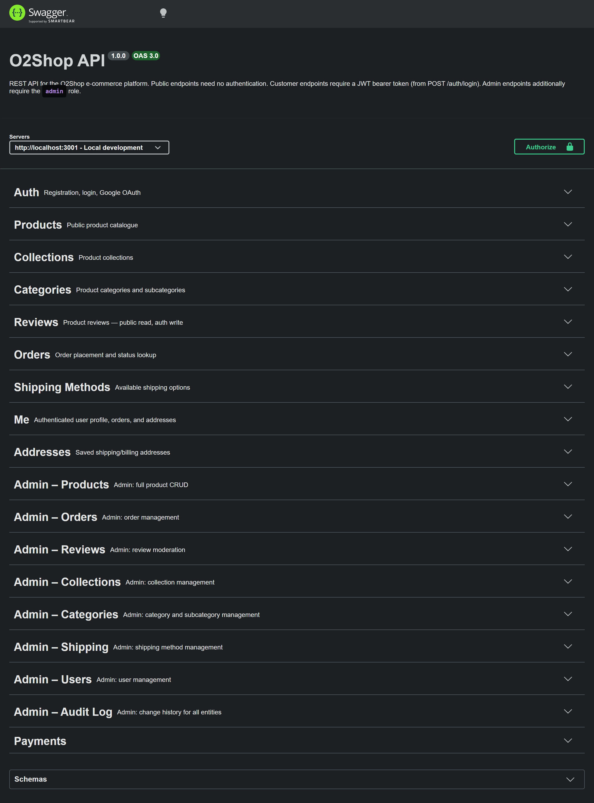

# nest-o2shop

> **Learning Project** — This is a personal pet project built for learning purposes only. It is not intended for production use.

A fully-featured e-commerce REST API built with **NestJS**, demonstrating real-world patterns: 
- Modular architecture
- JWT + Google OAuth authentication 
- Role-based access control
- Order management with stock locking
- Swagger-documented API.



---

## Technology Stack

| Layer | Technology |
|---|---|
| Package manager | pnpm |
| Runtime | Node.js 22 |
| Framework | NestJS 11 |
| Language | TypeScript 5.7 |
| ORM | TypeORM 1.x |
| Database | PostgreSQL 17 |
| Validation | class-validator + class-transformer |
| Password hashing | bcrypt |
| Auth | Passport.js — Local, JWT, Google OAuth 2.0 |
| API Docs | Swagger / OpenAPI (via `@nestjs/swagger`) |
| Containerisation | Docker + Docker Compose |

---

## Architecture

The project follows NestJS's modular feature architecture. Each domain is self-contained with its own entity, service, controller(s), DTOs, and module file.

```
Request → AuthenticationGuard → RolesGuard → Controller → Service → TypeORM → PostgreSQL
```

### Module overview

| Module | Responsibility |
|---|---|
| `AuthModule` | Local/JWT/Google auth, token issuance & refresh, logout |
| `UsersModule` | User CRUD, admin management, guest-data linking on registration |
| `ProductsModule` | Product catalogue, variants, photos, admin CRUD, soft-delete |
| `CollectionsModule` | Product collections (active/inactive) |
| `CategoriesModule` | Categories and subcategories |
| `ReviewsModule` | Public submission, admin moderation, status lifecycle |
| `OrdersModule` | Guest & authenticated checkout with pessimistic stock locking |
| `ShippingModule` | Shipping method management |
| `AddressesModule` | Saved shipping/billing addresses per user |
| `MeModule` | Authenticated user profile, orders, and addresses |
| `PaymentsModule` | Stripe payment intents (auth + guest) and webhook handling |
| `AuditModule` | Automatic audit logging of entity changes via TypeORM subscriber |
| `StorageModule` | Abstract file storage — local by default, easily swappable for S3 |
| `HashingModule` | Abstract hashing — bcrypt by default |
| `DatabaseModule` | TypeORM async configuration |

### Authentication flow

- **Local** — `POST /auth/login` validates credentials, issues an access + refresh token pair as HttpOnly cookies and in the response body
- **JWT** — every protected route runs `JwtStrategy`, which verifies the token and checks `tokenVersion` to support global invalidation
- **Google OAuth** — `GET /auth/google/login` redirects to Google; on return, the callback issues tokens the same way as local login

Access tokens carry `tokenVersion` for global invalidation on logout. Refresh tokens are stored server-side with rotation.

---

## Getting Started

### Prerequisites

- **Node.js** ≥ 22
- **pnpm** ≥ 10 (`corepack enable && corepack prepare pnpm@latest-10 --activate`)
- **Docker** + **Docker Compose** (for the database)
- A Google OAuth app (optional — only needed for Google login)

### 1. Installation

```bash
pnpm install
```

### 2. Configure environment

Create a `.env` file in the project root:

```env
# Environment
NODE_ENV=development

# Database
# Note: docker-compose overrides DB_HOST to "postgres" inside the container
DB_HOST=localhost
DB_PORT=5432
DB_USERNAME=
DB_PASSWORD=
DB_NAME=

# JWT
JWT_SECRET=
JWT_REFRESH_SECRET=
JWT_ACCESS_TOKEN_TTL=3600    # 1 hour
JWT_REFRESH_TOKEN_TTL=86400  # 24 hours

# Google OAuth (optional — only needed for Google login)
GOOGLE_CLIENT_ID=
GOOGLE_CLIENT_SECRET=
GOOGLE_CALLBACK_URL=http://localhost:3001/auth/google/redirect

# Rate limiting (TTL in milliseconds)
THROTTLE_DEFAULT_LIMIT=60
THROTTLE_DEFAULT_TTL=60000
THROTTLE_AUTH_LIMIT=5
THROTTLE_AUTH_TTL=60000

# Stripe
STRIPE_SECRET_KEY=
STRIPE_WEBHOOK_SECRET=
```

### 3. Start with Docker Compose (recommended)

This starts both Postgres and the NestJS app with hot-reload:

```bash
docker compose up
```

The API will be available at `http://localhost:3001`.

### 4. Start locally (app only)

If you prefer to run Postgres separately:

```bash
# Start only the database
docker compose up postgres

# Run the app in watch mode
pnpm run start:dev
```

### 5. Testing Stripe payments locally

Stripe webhooks (`payment_intent.succeeded`, etc.) can't reach `localhost` directly — without something forwarding them in, a successful payment on Stripe's side will never update the order's `paymentStatus`. Use the Stripe CLI to forward events during local dev:

```bash
pnpm run stripe:listen
```

This wraps `stripe listen --forward-to localhost:3001/payments/stripe/webhook`. Keep it running for the entire time you're testing payments, not just at startup — it needs to be alive when the webhook actually fires.

On startup it prints a signing secret (`whsec_...`). This must match `STRIPE_WEBHOOK_SECRET` in `.env` — if it doesn't, update `.env` and restart the backend.

> **Gotcha:** the Stripe CLI must be logged into the *same Stripe account* that issued `STRIPE_SECRET_KEY`, or events are silently never forwarded — no error, nothing, the order just stays `pending` forever. Check with `stripe config --list` and compare its `test_mode_api_key` against `STRIPE_SECRET_KEY` in `.env`. If they're on different accounts, run `stripe login` again and pick the matching one.

---

## Key Features

- **Dual-surface controllers** — every resource has a public/customer controller and an `admin/` controller with full CRUD and extra filters
- **Role-based access control** — `@Auth(AuthType.Bearer)` + `@Roles(Role.ADMIN)` applied via global guards
- **Rate limiting** — global throttler with a stricter limit on auth endpoints; admin-role users are exempt
- **Audit logging** — entity changes are recorded automatically via a TypeORM subscriber, queryable through the admin audit log endpoint
- **Google OAuth 2.0** — sign-in creates or links accounts automatically
- **Guest checkout** — orders can be placed without an account; orders and reviews are retroactively linked on registration
- **Pessimistic stock locking** — order creation acquires a `SELECT ... FOR UPDATE` lock to prevent overselling
- **Soft-delete** — products and users support soft-delete with admin-only `includeDeleted` filter
- **Structured product descriptions** — JSONB `blocks` field supports `text` and `points` block types
- **Paginated responses** — all list endpoints use a consistent `{ data, total, page, limit }` envelope
- **Local file storage** — uploaded product photos are served from `/uploads`. The `StorageService` is abstract; swapping to AWS S3 only requires providing an alternative implementation — see [Swapping to S3](#-swapping-to-s3)
- **OpenAPI spec export** — on startup the full spec is written to `specs/openapi.json`

---

## API Documentation

Swagger UI is served at:

```
http://localhost:3001/api/docs
```

The OpenAPI JSON spec is written to `specs/openapi.json` on every startup.

**Auth in Swagger:** use `POST /auth/login` to get an `access_token`, then click **Authorize** and paste it into the `access_token` bearer field.

---

## Swapping to S3

Media files are currently stored on disk via `LocalStorageService`. Because storage is abstracted behind `StorageService` (an abstract class injected globally), switching to AWS S3 requires only:

1. Install the AWS SDK: `pnpm add @aws-sdk/client-s3`
2. Create `src/common/storage/s3-storage.service.ts` that extends `StorageService` and implements `save()`, `delete()`, and `getUrl()`
3. In `StorageModule`, change `useClass: LocalStorageService` to `useClass: S3StorageService`

No other code needs to change.

---

## Scripts

```bash
pnpm run start:dev     # Watch mode (hot-reload)
pnpm run start:debug   # Watch + Node inspector
pnpm run build         # Compile to /dist
pnpm run start:prod    # Run compiled output
pnpm run lint          # ESLint with auto-fix
pnpm run format        # Prettier format
pnpm run stripe:listen # Forward Stripe webhook events to localhost:3001 (required for payment status updates in dev)
pnpm run seed          # Seed the database
pnpm run migration:generate  # Generate a TypeORM migration from entity changes
pnpm run migration:run       # Run pending migrations
pnpm run migration:revert    # Revert the last migration
```

---

## License

UNLICENSED — personal learning project, not for redistribution.